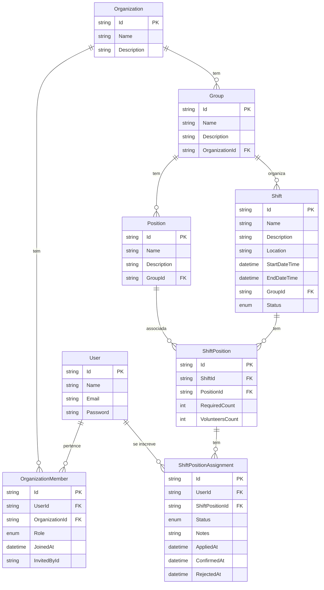

# Volts Frontend – Sistema de Gestão de Voluntários


## Integrantes

- Adriano Barros
- Brendon Gomes
- Elias Barbosa
- Rafael Gonçalves

## Projeto

O Volts é um sistema de gestão de voluntários utilizado por organizações para administrar equipes, grupos, posições e escalas de eventos.
Este repositório contém o frontend, desenvolvido em React + TypeScript, responsável por fornecer uma interface moderna, rápida e intuitiva para administradores, líderes e voluntários.

Os usuários podem visualizar escalas, aplicar-se para posições, gerenciar grupos, editar informações da organização e atualizar seus perfis.

O frontend se integra diretamente ao backend .NET via API REST, consumindo endpoints protegidos por JWT.

## 🧰 Tecnologias Utilizadas

- React 18
- TypeScript
- Vite
- React Router DOM
- React Query
- Axios
- React Hook Form
- Zod
- Shadcn/ui
- Tailwind CSS
- Lucide Icons

## ⚙️ Funcionalidades da Aplicação

### 👤 Autenticação

- Login com email e senha
- Armazenamento e uso de token JWT
- Redirecionamento por role e permissões
- Estado global com React Query + persistência

### 🏢 Organizações

- Listagem das organizações das quais o usuário participa
- Visualização de detalhes da organização
- Gerenciamento de membros da organização (organization member)
- Controle de permissões baseado no `OrganizationRoleEnum`:
  - Admin
  - Leader
  - Member

#### 🧩 Grupos (Groups)

- Listagem de grupos da organização
- Criação e edição de grupos
- Visualização de posições e escalas do grupo
- Responsável por agrupar as escalas (como uma sub-divisão)

#### 🪪 Posições (Positions)

- Criar, editar e excluir posições
- Prevenção de remoção caso haja escalas associadas
- Visualização de detalhes

#### 🕒 Escalas (Shifts)

- Criar, editar e visualizar escalas
- Ver status: *open*, *filled*, *closed*
- Visualizar posições necessárias e quantidade de vagas
- Ver responsáveis e participantes

#### Visualização completa da escala 📌 (Via endpoint de Shift Complete View)

Interface completa de exibição de escala, trazendo:

- Shift
- Shift Positions
- Voluntários inscritos na posição (Assignments)

Incluindo:

- Nome, email, status e notas do voluntário
- Quantidade necessária vs preenchida
- Status da posição

#### ✋ Voluntariado / Inscrição

- Usuário pode se aplicar para vagas
- Pode cancelar inscrição
- Pode visualizar seu status (pendente, aprovado etc.)

#### 🎨 UI e Componentização

- Sistema completo usando Shadcn UI
- Tailwind CSS com linter e autocomplete
- Skeletons para carregamento
- Components reutilizáveis:
  - Cards
  - Badges
  - Avatares
  - Forms com React Hook Form + Validações em tempo real com Zod
  - Layouts de navegação

## 🧠 Modelo de Domínio (Frontend)

As principais entidades do sistema se relacionam da seguinte forma:

- **Organizações (Organizations)**: Entidade principal que representa uma instituição ou evento
- **Grupos (Groups)**: Subdivisões dentro de uma organização, como departamentos ou equipes
- **Escalas (Shifts)**: Períodos de trabalho com data, hora e local definidos
- **Posições (Positions)**: Funções específicas que podem ser ocupadas por voluntários
- **Inscrições (ShiftPositionAssignments)**: Registros de voluntários inscritos para trabalhar em posições específicas

### Diagrama das tabelas da aplicação

O diagrama abaixo representa as principais entidades do sistema Volts e seus relacionamentos.



## 📁 Estrutura Geral do Projeto

```txt
src/
 ├── api/                ## Funções de requisições HTTP
 ├── components/         ## Componentes reutilizáveis
 ├── hooks/              ## Hooks com React Query
 ├── layouts/            ## Layouts principais
 ├── models/             ## Tipos e interfaces do domínio
 ├── pages/              ## Páginas da aplicação
 ├── routes/             ## Rotas da aplicação
 ├── utils/              ## Funções utilitárias
 ├── lib/                ## Configurações auxiliares
 └── main.tsx            ## Código principal de entrada da aplicação
```

## ▶️ Como Rodar o Projeto

```bash
# 1. Clonar o repositório
git clone https://github.com/seu-usuario/volts-frontend.git
cd volts-frontend

# 2. Instalar dependências

npm install

# 3. Configurar variáveis de ambiente

# Criar arquivo .env.development contendo:

VITE_API_URL=http://localhost:5000 ## url do backend

# 4. Executar

npm run dev
# Aplicação ficará disponível em:

http://localhost:5173
```

## 🛠️ Build e Deploy

```bash
npm run build
npm run preview
```
