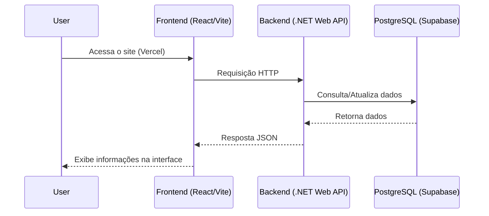
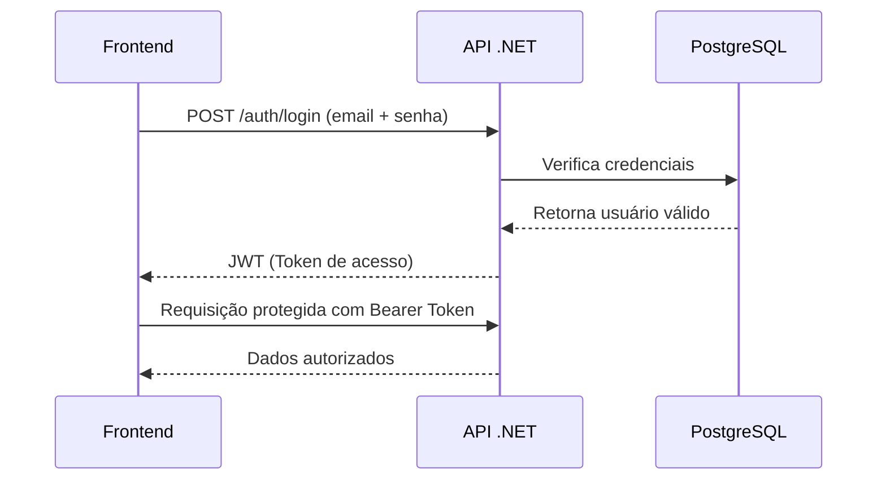
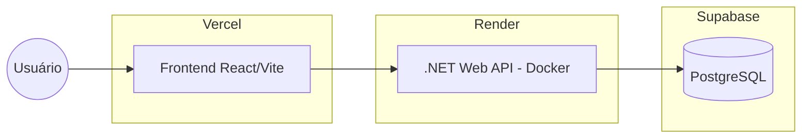

# 📘 Arquitetura e Infraestrutura do Projeto Volts

- [📘 Arquitetura e Infraestrutura do Projeto Volts](#-arquitetura-e-infraestrutura-do-projeto-volts)
  - [📌 Visão Geral](#-visão-geral)
  - [🏗️ Arquitetura do Projeto](#️-arquitetura-do-projeto)
  - [🎨 Frontend – Tecnologias e Implementação](#-frontend--tecnologias-e-implementação)
    - [⚛️ React + Vite](#️-react--vite)
    - [📚 Shadcn UI + Radix](#-shadcn-ui--radix)
    - [🔄 React Query](#-react-query)
    - [📝 React Hook Form + Zod](#-react-hook-form--zod)
    - [🌐 Roteamento](#-roteamento)
    - [⚙️ Build](#️-build)
    - [Segurança](#segurança)
  - [⚙️ Backend – Tecnologias e Arquitetura](#️-backend--tecnologias-e-arquitetura)
    - [🧩 C# .NET 8 Web API](#-c-net-8-web-api)
    - [🗄️ Entity Framework Core (Com o driver do postgres Npgsql)](#️-entity-framework-core-com-o-driver-do-postgres-npgsql)
    - [🌐 CORS](#-cors)
    - [🔐 Configurações via Environment Variables](#-configurações-via-environment-variables)
  - [🗄️ Banco de Dados – Supabase (PostgreSQL)](#️-banco-de-dados--supabase-postgresql)
    - [📍 PostgreSQL gerenciado](#-postgresql-gerenciado)
    - [🔁 Connection Pooler](#-connection-pooler)
    - [🔐 Segurança](#-segurança)
  - [🌩️ Infraestrutura em Nuvem](#️-infraestrutura-em-nuvem)
  - [Backend – Render](#backend--render)
    - [🚀 Deploy no Backend](#-deploy-no-backend)
    - [🔧 Configurações](#-configurações)
    - [📦 Dockerfile usado para deploy](#-dockerfile-usado-para-deploy)
  - [Frontend – Vercel](#frontend--vercel)
    - [🚀 Deploy no Frontend](#-deploy-no-frontend)
    - [🔧 Configurações essenciais](#-configurações-essenciais)
    - [🌍 CDN](#-cdn)
  - [🌐 Principais Serviços Web Utilizados](#-principais-serviços-web-utilizados)
    - [Supabase](#supabase)
    - [Render](#render)
    - [Vercel](#vercel)
  - [🧠 Benefícios da Arquitetura](#-benefícios-da-arquitetura)

## 📌 Visão Geral

O sistema consiste em uma aplicação web para gerenciamento de escalas e voluntários, organizada em arquitetura cliente-servidor.
A solução é composta por:

- **Frontend** em React + Vite
- **Backend** em C# .NET Web API
- **Banco de dados** PostgreSQL no Supabase
- **Deploy do Backend** na plataforma Render
- **Deploy do Frontend** na plataforma Vercel

Toda a comunicação entre as camadas ocorre via API REST, garantindo desacoplamento, escalabilidade e manutenção simplificada.



---

## 🏗️ Arquitetura do Projeto

```txt
┌────────────────────────────────┐
│            FRONTEND            │
│  React + Vite + TypeScript     │
│  UI com Shadcn + Radix         │
│  React Query (tanstack query)  │
│  React Hook Form + Zod         │
└───────────────▲────────────────┘
                │ (HTTPS, JSON)
                ▼
┌────────────────────────────────┐
│            BACKEND             │
│     C# .NET 8 Web API          │
│ ASP.NET Core Controllers       │
│ Entity Framework Core (Npgsql) │
│ Validações + Middlewares       │
└───────────────▲────────────────┘
                │ (TCP 5432)
                ▼
┌────────────────────────────────┐
│          SUPABASE DB           │
│ PostgreSQL gerenciado          │
│ Connection Pooler              │
│ Segurança + SSL                │
└────────────────────────────────┘
```

---

## 🎨 Frontend – Tecnologias e Implementação

### ⚛️ React + Vite

- Utiliza **Vite** como bundler, garantindo builds rápidos e ambiente de desenvolvimento otimizado.
- Projeto escrito em **TypeScript** para maior segurança de tipos.

### 📚 Shadcn UI + Radix

- Conjunto de componentes com foco em:

  - Acessibilidade (ARIA pronto)
  - Estilização com Tailwind CSS
  - Componentes reutilizáveis e personalizáveis

### 🔄 React Query

Responsável pelo gerenciamento de estado remoto:

- Cache de requisições feitas -> Evitar várias requisições que não houveram alteração
- QueryKeys padronizadas -> Chaves utilizadas para fazer o cache interno
- Mutations com invalidation automática -> Quando é feito alguma alteração no banco de dados, faz com que outras requisições GET sejam feitas novamente automaticamente, mantendo a UI atualiazada

### 📝 React Hook Form + Zod

Validação tipada com schemas compartilhados entre UI e Backend:

- Formulários performáticos
- Validação segura com validações do Zod

### 🌐 Roteamento

- React Router DOM com SPA (Single Page Application)

### ⚙️ Build

- Deploy contínuo pelo Vercel a partir da branch principal

### Segurança

- Autorização -> Acesso de login feito através de JWT (Json Web Token)



---

## ⚙️ Backend – Tecnologias e Arquitetura

### 🧩 C# .NET 8 Web API

- Estrutura em camadas:

  - **Controllers** -> Redireciona as rotas para os services
  - **Services** -> Camada principal de regras de negócios
  - **Repositories** -> Responsável pela comunicação com o banco de dados
  - **DTOs** -> Objetos que serão utilizados para mandar para o front end
  - **Entities** -> Entidades das tabelas do banco de dados
- Utiliza Dependency Injection nativa do .NET

### 🗄️ Entity Framework Core (Com o driver do postgres Npgsql)

- Mapeamento ORM com Migrations
- Conexão direta com PostgreSQL
- Context configurado para rodar `Database.Migrate()` no startup

### 🌐 CORS

CORS configurado para permitir que a API só se comunique com a aplicação que foi está rodando no Vercel

```txt
https://volts-frontend.vercel.app
```

### 🔐 Configurações via Environment Variables

- Sensitive data não é enviada no repositório
- Variáveis configuradas no Render:

  - `ConnectionStrings__DefaultConnection`
  - `ASPNETCORE_ENVIRONMENT=Production`
  - `JWT_SECRET` (se usado)
  - Outras credenciais necessárias

---

## 🗄️ Banco de Dados – Supabase (PostgreSQL)

### 📍 PostgreSQL gerenciado

- Alta performance e disponibilidade
- Conexão segura via SSL

### 🔁 Connection Pooler

Para funcionar no Render, foi adotado o **Session Pooler** (IPv4), recomendado pelo Supabase para evitar falhas de conexão IPv6.

### 🔐 Segurança

- Acesso via connection string única
- Regras de firewall e rede aplicadas pelo Supabase
- Certificados SSL obrigatórios

---

## 🌩️ Infraestrutura em Nuvem

<small>Diagrama de como a infraestrutura da nuvem foi implementada</small>



## Backend – Render

### 🚀 Deploy no Backend

- Dockerfile customizado para .NET 8 (imagem oficial via SDK + runtime)
- Build via container isolado

### 🔧 Configurações

- Environment Variables
- Health check configurado
- Serviço como **Web Service** (Auto deploy ON)
- Logs e monitoramento nativos do Render

### 📦 Dockerfile usado para deploy

Baseado em multi-stage para reduzir o tamanho da imagem.

---

## Frontend – Vercel

### 🚀 Deploy no Frontend

- Deploy automático via GitHub -> CI/CD do próprio Vercel
  - Quando já faz o commit na main para o github, já entra no pipeline do Vercel para fazer o deploy
- Configuração do output para `dist/`

### 🔧 Configurações essenciais

Arquivo `vercel.json`:

```json
{
  "$schema": "https://openapi.vercel.sh/vercel.json",
  "rewrites": [
    {
      "source": "/(.*)",
      "destination": "/index.html"
    }
  ]
}
```

Garantindo a aplicação rodar como SPA - Single Page Application

### 🌍 CDN

- Arquivos estáticos são distribuídos globalmente
- Build otimizado automaticamente pelo Vercel

---

## 🌐 Principais Serviços Web Utilizados

### Supabase

- PostgreSQL gerenciado
- Connection pool
- SSL/TLS
- Painel de administração amigável

### Render

- Deploy automatizado da API
- Execução em container
- Logs e monitoramento integrados

### Vercel

- Deploy do frontend (SPA)
- CDN global
- Rewrites configurados para SPA

---

## 🧠 Benefícios da Arquitetura

- **Independência entre frontend e backend**
- **Deploy contínuo (CI/CD) automático**
- **Infraestrutura escalável (Vercel + Render + Supabase)**
- **Segurança via variáveis de ambiente**
- **UI acessível e escalável com shadcn**
- **API padronizada com .NET Web API**
- **Banco gerenciado com backups automáticos**
